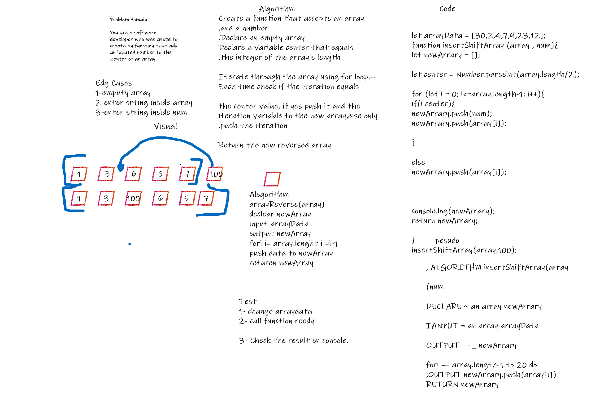

# Insert to Middle of an Array
function give me shift data in array without use in-built words javaScript 

## Whiteboard Process

## Approach & Efficiency
<!-- What approach did you take? Discuss Why. What is the Big O space/time for this approach? -->

time flexible ,  and   space flexible
time  O(n)
space  O(n)