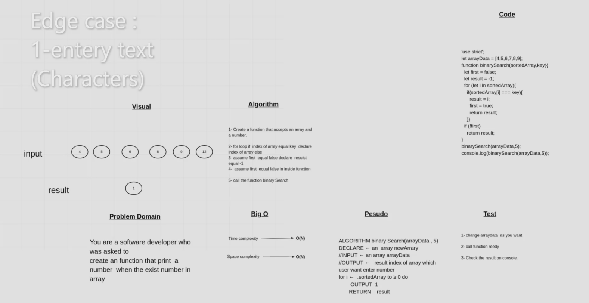

# Binary Search of Sorted Array
create an function that print  a number  which the user input key that return index of array that the number enter from user .

## Whiteboard Process

## Approach & Efficiency

time flexible ,  and   space flexible
time  O(n)
space  O(n)