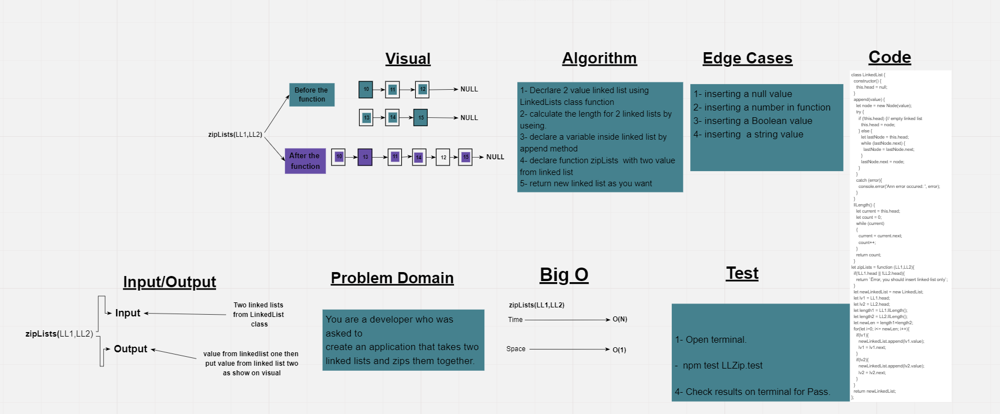

# Zip Lists
A function that accepts two  value as a linked lists, and combine them in one new linked list, if the inputs is not a linked lists, throw an exception.
input in first value from the link list one  and put second from linked list
## Whiteboard Process

## Approach & Efficiency
BigO:
1. checkLength --->  Time: O(n). 
                   Space: O(n). 
2. zipLists ---->    Time: O(n). 
                  Space: O(1). 
## Solution
### Example
                let nodeOne = new LinkedList; 
                let nodeTwo = new LinkedList;
                 nodeOne.append('10');
                  nodeOne.append('11');
                   nodeOne.append('12');
                   nodeTwo.append('13');
                   nodeTwo.append('14');
                    nodeTwo.append('15');
               
                
                zipLists(nodeOne,nodeTwo);