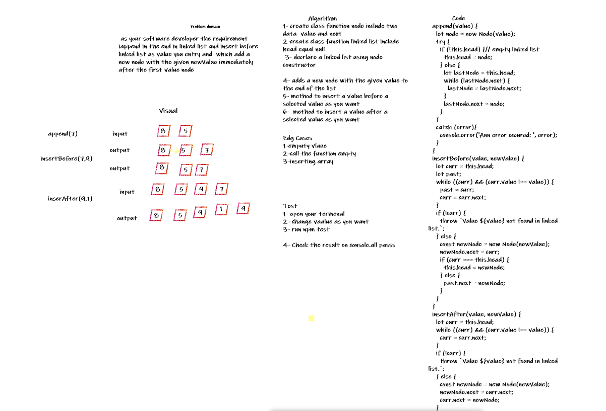

# Linked-list insertions

Inserting a new element into a singly linked list at beginning is quite simple. There are the following steps which need to be followed in order to insert a new node in the list at beginning. ...which add a new node with the given newValue immediately before the first value node ....which add a new node with the given newValue immediately after the first value node

## Whiteboard Process

## Approach & Efficiency
BigO:
* Append ----->  Time: O(n). 
                 Space: O(n). 
*  InsertBefore -> Time: O(n). 
                   Space: O(n). 
* InsertAfter -> Time O(n). 
                  Space: O(n). 
## Solution
### Example
        let newLink = new LinkedList;
        newLink.append(7);
        newLink.append(9);
        newLink.append(5);
        newLink.insertBefore(9,6);
        newLink.insertAfter(5,10);
        console.log(newLink);