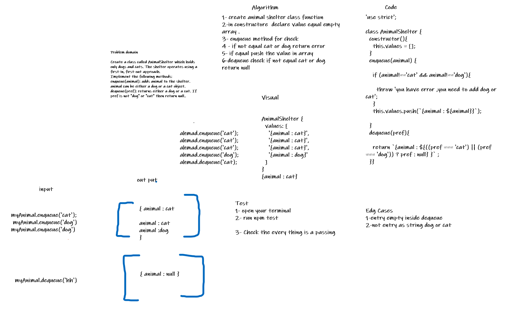

# Challenge Summary
Create a class called AnimalShelter which holds only dogs and cats. The shelter operates using a first-in, first-out approach.
Implement the following methods:
enqueue(animal): adds animal to the shelter. animal can be either a dog or a cat object.
dequeue(pref): returns either a dog or a cat. If pref is not "dog" or "cat" then return null.
## Whiteboard Process
 

## Approach & Efficiency
 Time ----> B O(1)  
 space ----> O(n) 
## Solution
// let ahmad = new AnimalShelter();  
// ahmad.enqueue('cat');  
// ahmad.enqueue('cat'); 

// ahmad.enqueue('cat');
// ahmad.enqueue('dog'); 
// ahmad.enqueue('dog'); 
// ahmad.enqueue('dog'); 
// ahmad.enqueue('dog'); 
// ahmad.enqueue('ahmad'); 
// // console.log(ahmad.dequeue('cat')); 
// console.log(ahmad.dequeue('hh')); 
// console.log(ahmad.dequeue('cat')); 
// console.log(ahmad.dequeue('dog')); 
// // ahmad.enqueue('cat'); 
// // ahmad.enqueue('ahmad'); 
// console.log(ahmad.values[0]); 