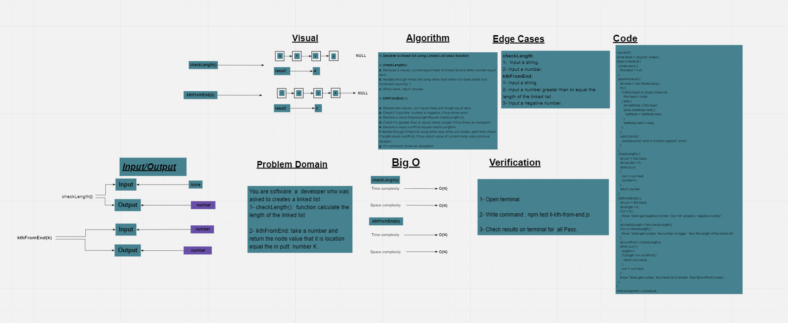

# ll-kth-from-end

method for the Linked List class which takes a number, k, as a parameter. Return the node’s value that is k from the end of the linked list .
## Whiteboard Process

## Approach & Efficiency
BigO:
1. checkLength --->  Time: O(n). 
                    Space: O(n). 
2. kthFromEnd --->  Time: O(n). 
                    Space: O(n). 
## Solution
### Example
        let test = new LinkedList;
        test.append(6);
        test.append(7);
        test.append(9);
        test.checkLength());
        test.checkLength(1);