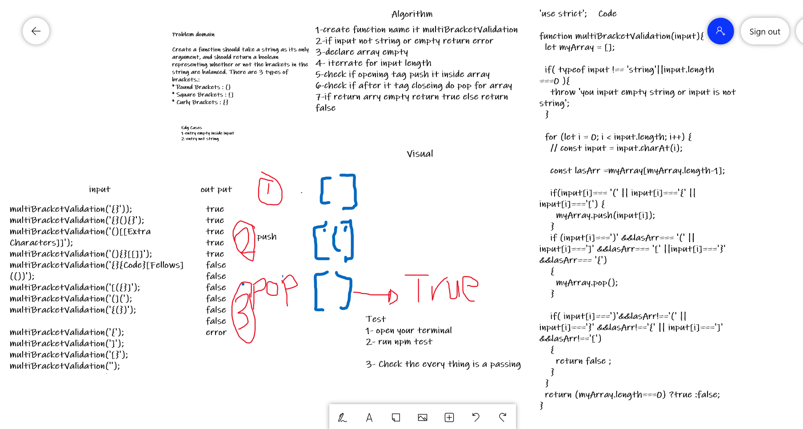

# Challenge Summary
Your function should take a string as its only argument, and should return a boolean representing whether or not the brackets in the string are balanced. There are 3 types of brackets:

* Round Brackets : () 
* Square Brackets : []
* Curly Brackets : {}

## Whiteboard Process

## Approach & Efficiency
 Time --> O(n) 
 space --> O(n) 

## Solution
 Run in Your terminal 
 `npm test multi-bracket-validation.test.js`

 console.log(isBalance('{}'));  
 console.log(isBalance('{}(){}')); 
 console.log(isBalance('()[[Extra Characters]]')); 
 console.log(isBalance('(){}[[]]')); 
 console.log(isBalance('{}{Code}[Fellows](())')); 
 console.log(isBalance('[({}]')); 
 console.log(isBalance('(](')); 
 console.log(isBalance('{(})')); 

 console.log(isBalance('{')); 
 console.log(isBalance(']')); 
 console.log(isBalance('[}')); 
 console.log(isBalance(''));   
