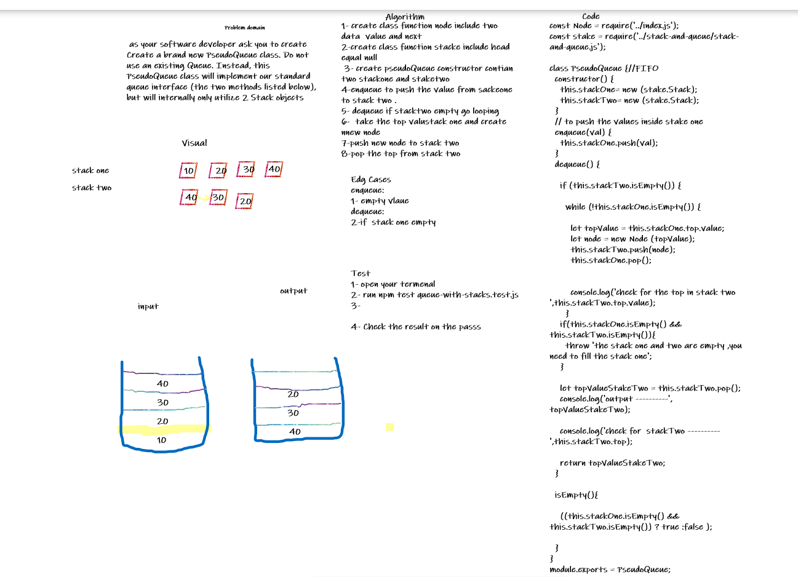

# Challenge Summary

Create a brand new PseudoQueue class. Do not use an existing Queue. Instead, this PseudoQueue class will implement our standard queue interface (the two methods listed below), but will internally only utilize 2 Stack objects.

## Whiteboard Process

## Approach & Efficiency
enqueue -- > Big O(1)  
                  O(1) 
 dequeue --> O(n) 
             O(n)                  

## Solution
npm test queue-with-stacks.test.js

     let myPseudoQueue = new PseudoQueue;

    
    myPseudoQueue.enqueue(10);
    myPseudoQueue.enqueue(20);
    myPseudoQueue.enqueue(30);
    myPseudoQueue.dequeue();

     