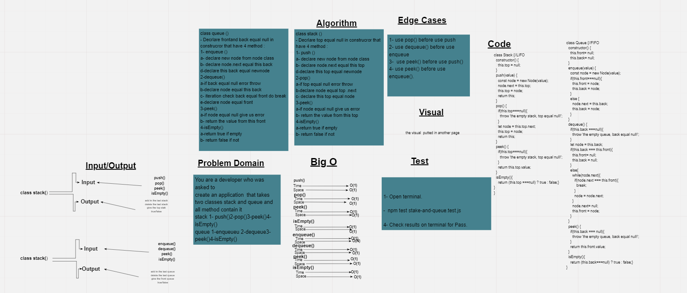
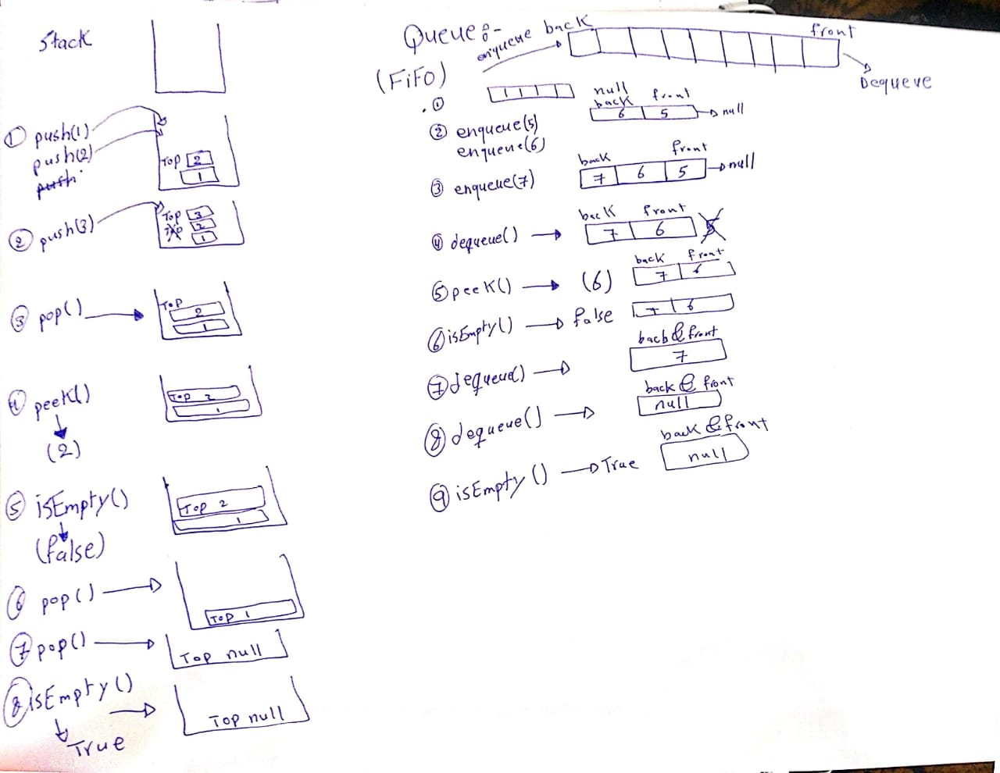

# Stacks and Queues

## Challenge
You are a developer who was asked to 

create an application  that takes two classes stack and queue and all method contain it 

stack 1- push()2-pop()3-peek()4-isEmpty()

queue 1-enqueueu 2-dequeue3-peek()4-isEmpty()

## Approach & Efficiency
push()-> Time O(1)  
          Space(1) 

pop ()-> Time O(1) 
          Space(1) 
peek()-> Time O(1) 
          Space(1) 
isEmpty()-> Time O(1) 
          Space(1)  
enqueue()-> Time O(1) 
          Space(1) 
dequeue()-> Time O(N) 
          Space(1) 
peek()-> Time O(1) 
          Space(1) 
isEmpty()-> Time O(1) 
          Space(1)                                                                      
## API
npm test stack-and-qurue.test.js

let ahmad = new Stack() 
ahmad.push(1) 
ahmad.push(2) 
ahmad.push(3) 
ahmad.pop() 
ahmad.peek() 
ahmad.isEmpty() 
let ahmad = new Queue() 
ahmad.enqueue(1) 
ahmad.enqueue(2) 
ahmad.enqueue(3) 
ahmad.dequeue() 
ahmad.peek() 
ahmad.isEmpty() 