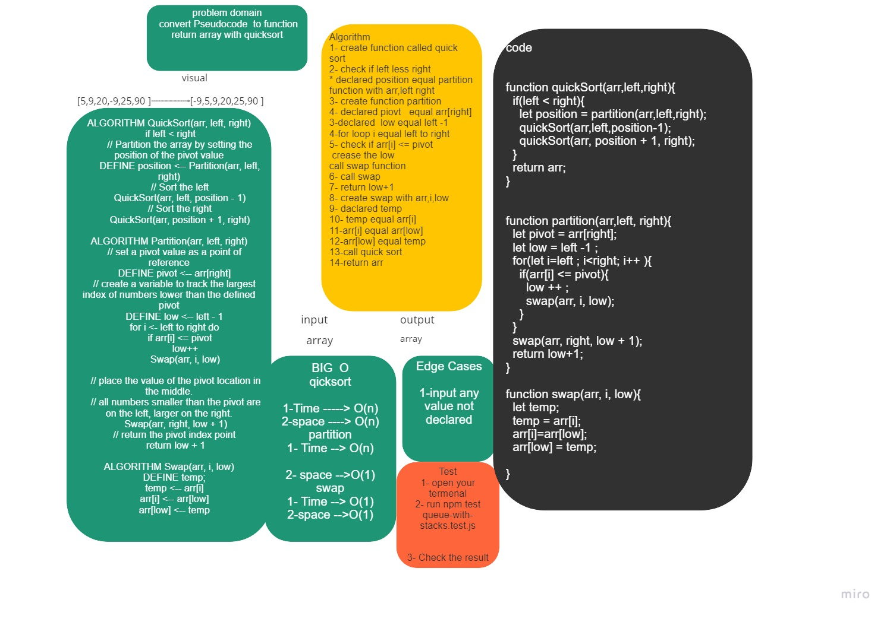

# Challenge Summary
convert pseudoscope to code quick sort

## Whiteboard Process


## Approach & Efficiency
quick sort by

Time --> O(n)<br>
Space --> O(n)<br>

partition 
Time --> O(n)<br>
Space --> O(1)<br>

swap 
Time --> O(1)<br>
Space --> O(1)<br>
## Solution
```
console.log(quickSort(array,0,array.length-1));
npm test QuickSort.test.js


```