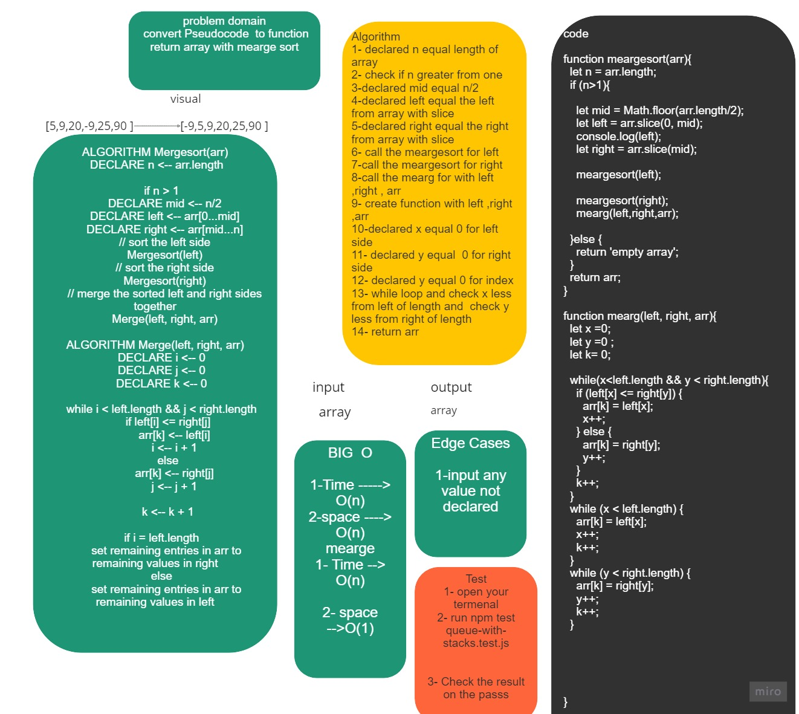

# Challenge Summary

 convert Pseudocode  to function return array with mearge sort

## Whiteboard Process


## Approach & Efficiency
```
meargeSort 
Time ----> O(n)
space ----> O(n)

mearge 
Time ----> O(n)
space----O(1)
```
## Solution 
```
npm test Reverse-sorted.test.js
 console.log(mergeSort([8,4,23,42,16,15]))
 ```