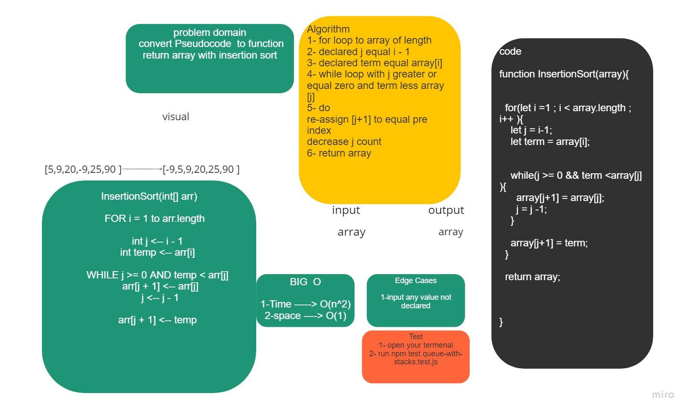

# Challenge Summary 
convert Pseudocode  to function return array with insertion sort  


## Whiteboard Process



## Approach & Efficiency

```
 Time ---> B(n^2)
 space ---> B(1)
 ```

## Solution
declared array equal any number <br>
calling the function called insertionSort  <br>

```
let array = [2,-9,15,38]
insertionSort(array);
```