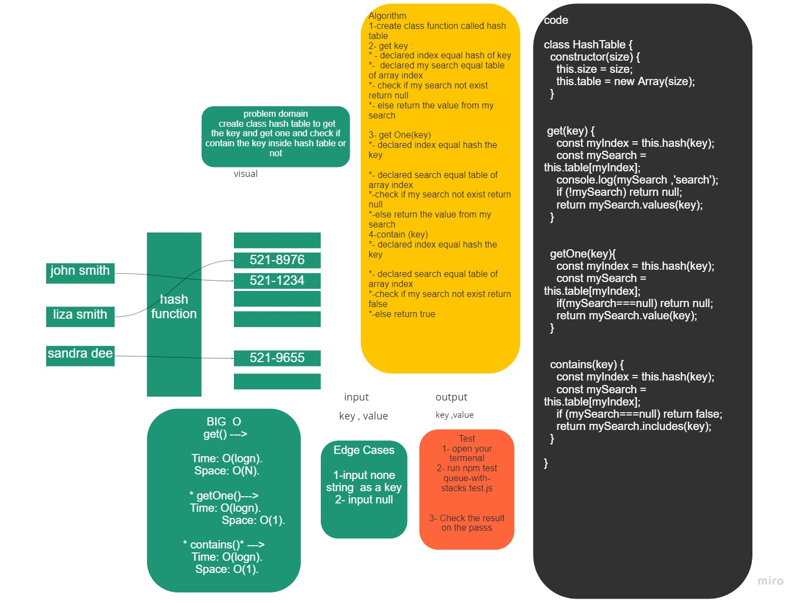

###  Hash tables
A hash table is a special collection that is used to store key-value items. So instead of storing just one value like the stack, array list and queue, the hash table stores 2 values. These 2 values form an element of the hash table. Below are some example of how values of a hash table might look like.


### white bored 



## Challenge
Implement a Hash table Class with the following methods:


* add
    arguments --->  key, value <br>
    returns --->  nothing <br>
    This method should hash the key, and add the key and value pair to the table, handling collisions as needed.<br>
* get
    arguments --->  key <br>
    returns: Value associated with that key in the table <br>
* contains
    arguments ---> key <br>
    returns --->  Boolean, indicating if the key exists in the table already. <br>
* hash
    arguments ---> key <br>
    returns --> Index in the collection for that key <br>


### Approach & Efficiency

```
* add() --->     Time: O(1).
                  Space: O(1).
* get() --->     Time: O(logn).
                  Space: O(N).
* getOne()--->    Time: O(logn).
                   Space: O(1).

* contains()* --->      Time: O(logn).
                       Space: O(1).
* hash() --->  Time: O(N).
               Space: O(1).

 ```

### API

```
// console.log( hash.table);
// hash.table.forEach((element, index) => {
//   console.log(index, element && element.values());
// });
// console.log('get correct: ', hash.get('marah'));
// console.log('get correct: ', hash.get('Allie'));
// console.log('get: ', hash.getOne('ahmad'));
// console.log('get: null ? ', hash.getOne('Cats'));
// console.log('contains incorrect: ', hash.contains('Jasonf'));
// console.log('contains correct: ', hash.contains('Jason'));
```


1. add(key,value)
This method should hash the key, and add the key and value pair to the table, handling collisions as needed. <br>
2. get(key)
Returns values associated with that key in the table.<br>
3. getOne(key)
Returns the value associated with that key in the table and avoiding collisions as needed. <br>
4. contains(key)
Returns boolean, indicating if the key exists in the table already.<br>
5. hash(key)
Returns index in the collection for that key. <br>