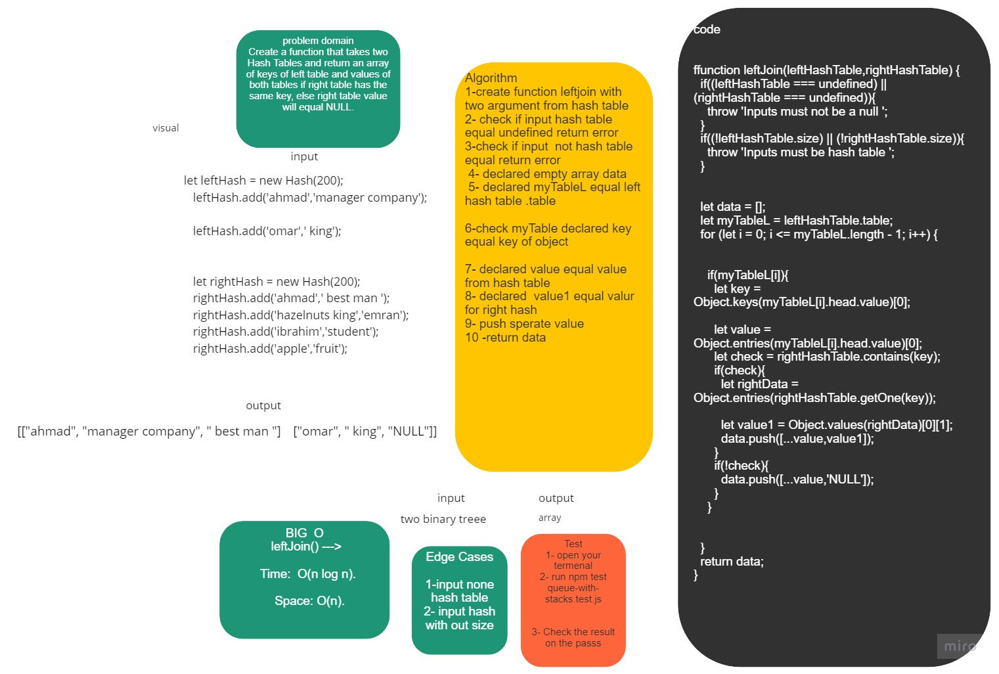

# LEFT JOINs


## Challenge Summary


Create a function that takes two Hash Tables and return an array of keys of left table and values of both tables if right table has the same key, else right table value will equal NULL.


## Whiteboard Process



## Approach & Efficiency
1. leftJoins(leftTable,rightTable) --->      Time:  O(n log n).
                                                 Space: O(n).
## Solution
### Example:
                
   ```
    let leftHash = new Hash(200);
    leftHash.add('ahmad','manager company');
    leftHash.add('hazelnuts king','amjad');
    leftHash.add('ibrahim','employee');
    leftHash.add('omar',' king');


    let rightHash = new Hash(200);
    rightHash.add('ahmad',' best man ');
    rightHash.add('hazelnuts king','emran');
    rightHash.add('ibrahim','student');
    rightHash.add('apple','fruit');
    ```
                
              