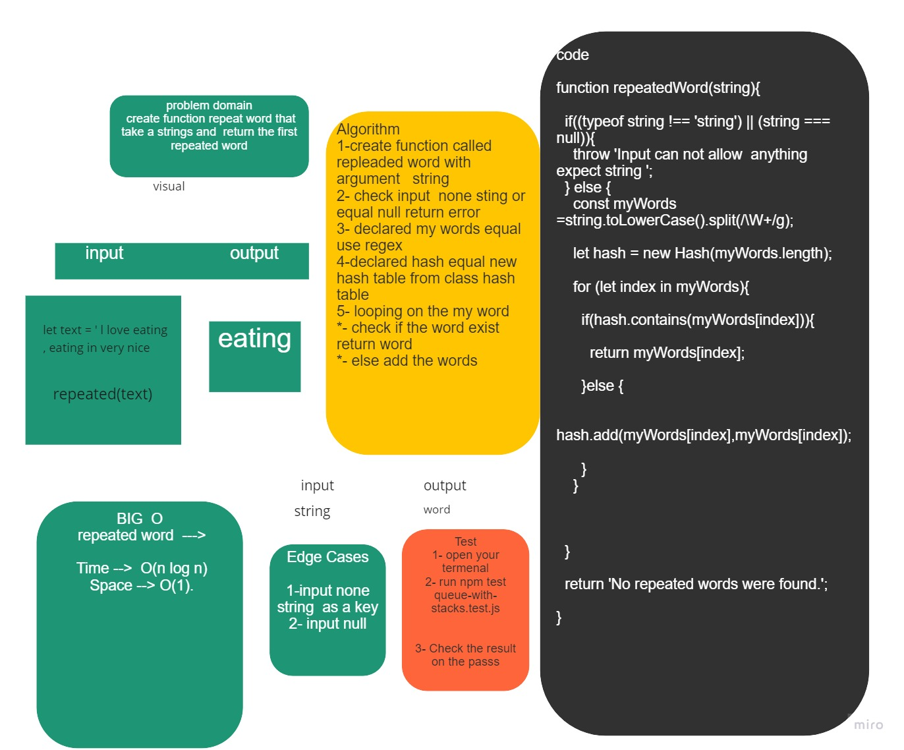

# Repeated word


## Challenge Summary
Create  functions called repeatedWord that take a strings and  return the first repeated word using HashTable.
## Whiteboard Process



## Approach & Efficiency
```

 repeatedWord(string)->      Time -->  O(n log n).
                             Space --> O(1).
```
## Solution

### Example:
    let str = 'emran melon emran melon melon melon';
    let str2 = 'this is boring';
    console.log(repeatedWord(str));
    console.log(repeatedWord(str2));
    console.log(repeatedWord(5));
    console.log(repeatedWord());