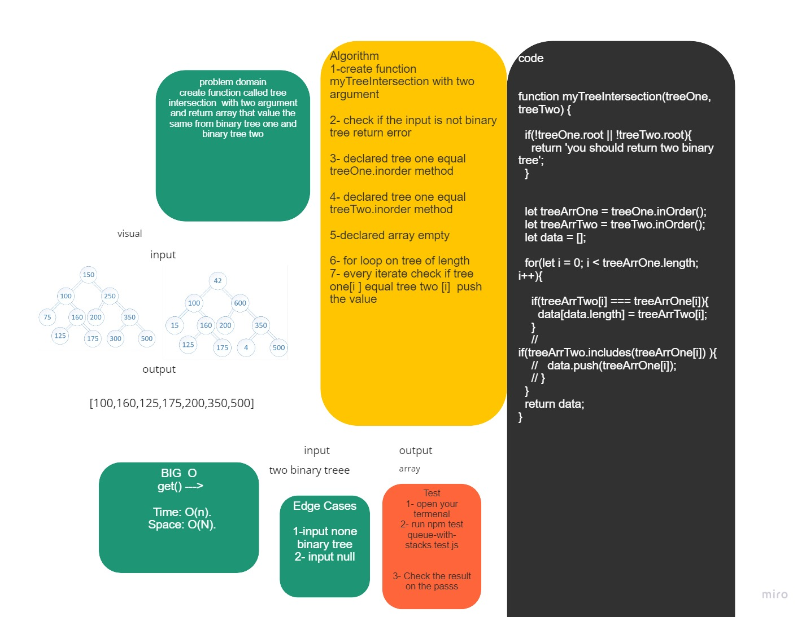

## hashmap tree intersection 

## Challenge Summary
Create  functions called myTreeIntersection that take a two binary tree and  return array. 
## Whiteboard Process



## Approach & Efficiency
```

 myTreeIntersection()->      Time -->  O(n).
                             Space --> O(n).
```
## Solution

### Example:
  ```
// let treeOne = new BinaryTree;
// treeOne.root = new Node(93);
// treeOne.root.left = new Node(20);
// treeOne.root.right = new Node(42);
// treeOne.root.left.left = new Node(75);

// treeOne.root.right.left = new Node(200);
// treeOne.root.right.right = new Node(350);
// treeOne.root.right.right.left = new Node(4);
// treeOne.root.right.right.right = new Node(99);

// const treeTwo = new BinaryTree;
// treeTwo.root = new Node(93);
// treeTwo.root.left = new Node(20);
// treeTwo.root.right = new Node(96);
// treeTwo.root.left.left = new Node(15);

// treeTwo.root.right.left = new Node(200);
// treeTwo.root.right.right = new Node(350);
// treeTwo.root.right.right.left = new Node(4);
// treeTwo.root.right.right.right = new Node(99);

// console.log(myTreeIntersection(treeOne,treeTwo));

```
