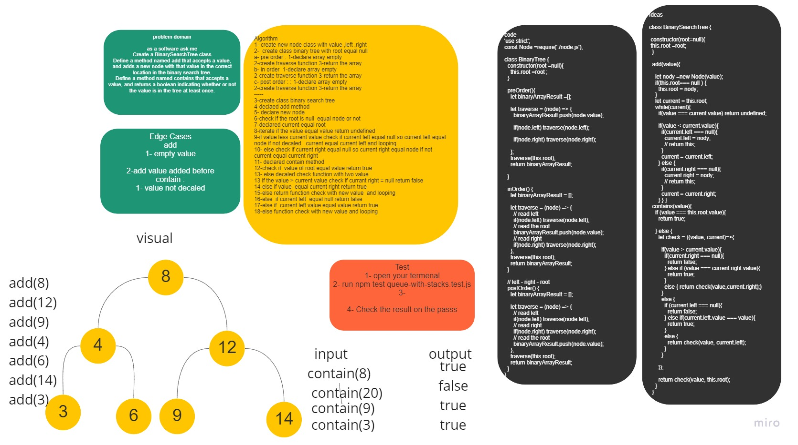

# Trees
A tree is a nonlinear data structure, compared to arrays, linked lists, stacks and queues which are linear data structures. A tree can be empty with no nodes or a tree is a structure consisting of one node called the root and zero or one or more subtrees.

## White board 



## Approach & Efficiency
method preOrder Time ---> O(n) <br>
space ---> O(h)<br>

method inOrder Time ---> O(n)<br>
space ---> O(h)<br>

method postOrder Time ---> O(n)<br>
space ---> O(h)<br>


method add Time ---> O(log n)<br>
            space--->O(1)<br>

 method contains Time ---> O(log n)<br>
                 space ---> O(1)           

## API
let one = new Node(1);// tree root <br>
    let two = new Node(2);<br>
    let three = new Node(3);<br>
    let four = new Node(4);<br>
    let five = new Node(5);<br>
    let six = new Node(6);<br>
    let seven = new Node(7);<br>
    let eight = new Node(8);<br>
    let nine = new Node(9);<br>

    one.left = two;  <br>
    one.right = three; 
    two.left = six; 
    six.right = seven;
    seven.left = eight;
    seven.right = nine;
    three.left = four;
    three.right = five;

```
    let test = new  BinarySearchTree();

test.add(8); 
test.add(12);
test.add(4);
test.add(9);
test.add(5);
// test.contains(5)
console.log(test);

console.log(test.contains(8) );// true
// mellon();
```