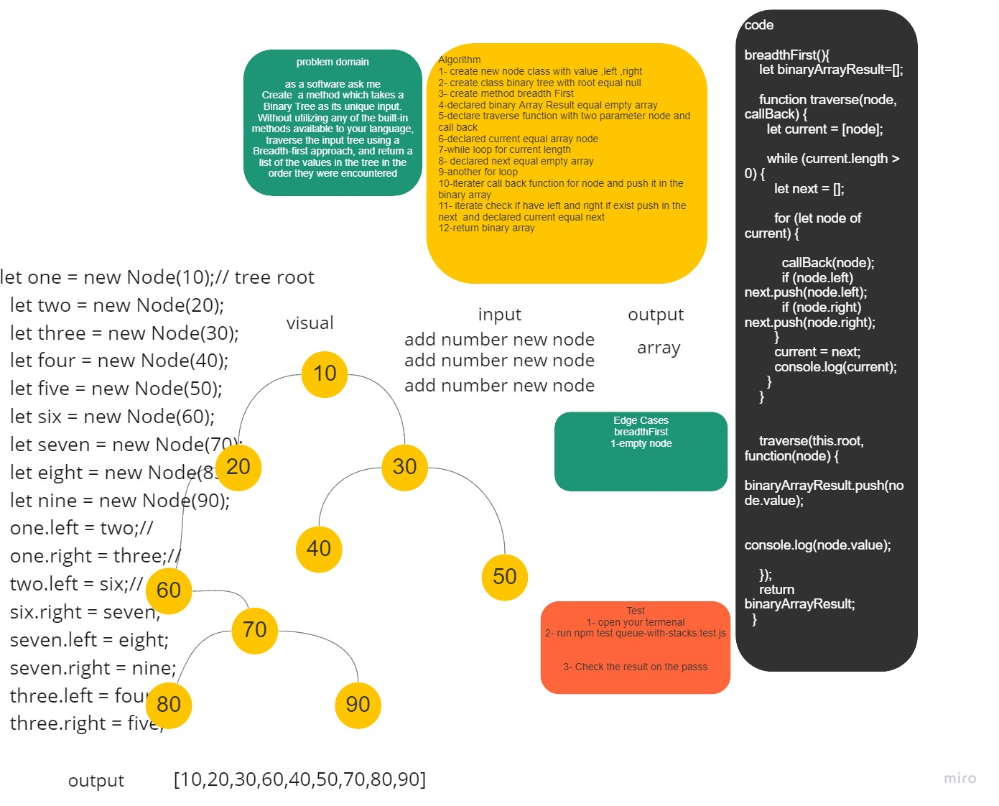

# Challenge Summary

Write a breadth first traversal method which takes a Binary Tree as its unique input. Without utilizing any of the built-in methods available to your language, traverse the input tree using a Breadth-first approach, and return a list of the values in the tree in the order they were encountered.

## Whiteboard Process



## Approach & Efficiency
Time --- > O(n^2) <br>
space ---> O(n) <br>

## Solution
```
  let one = new Node(10);// tree root
    let two = new Node(20);
    let three = new Node(30);
    let four = new Node(40);
    let five = new Node(50);
    let six = new Node(60);
    let seven = new Node(70);
    let eight = new Node(85);
    let nine = new Node(90);

    one.left = two;//
    one.right = three;//
    two.left = six;//
    six.right = seven;
    seven.left = eight;
    seven.right = nine;
    three.left = four;
    three.right = five;

     tree = new Trees(one);

     tree.breadthFirst(); output // [10, 20, 30, 60, 40, 50, 70, 85, 90]
```
