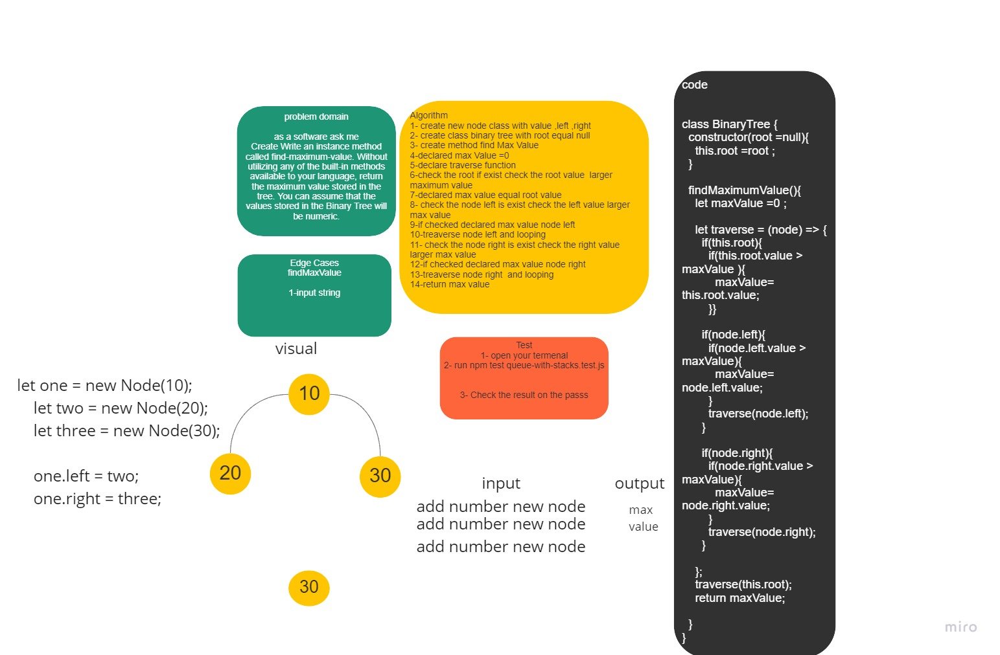

# Challenge Summary

Write an instance method called find-maximum-value. Without utilizing any of the built-in methods available to your language, return the maximum value stored in the tree. You can assume that the values stored in the Binary Tree will be numeric.

## Whiteboard Process


## Approach & Efficiency

Time ---> O(n) <br>
space --->O(h) <br>
## Solution
```
  let one = new Node(10);// tree root
    let two = new Node(20);
    let three = new Node(30);
    let four = new Node(40);
    let five = new Node(50);
    let six = new Node(60);
    let seven = new Node(70);
    let eight = new Node(85);
    let nine = new Node(90);

    one.left = two;//
    one.right = three;//
    two.left = six;//
    six.right = seven;
    seven.left = eight;
    seven.right = nine;
    three.left = four;
    three.right = five;

    // output 90
    ```
