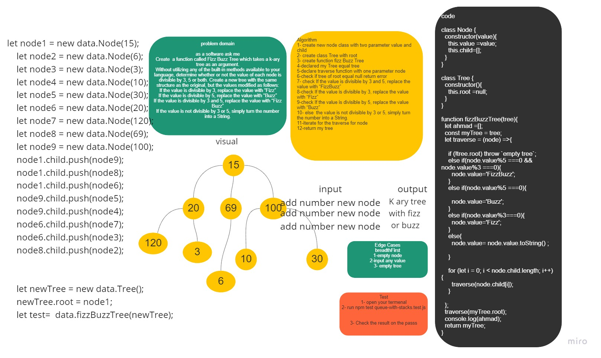

# Challenge Summary
Write a function called FizzBuzzTree which takes a k-ary tree as an argument.
Without utilizing any of the built-in methods available to your language, determine whether or not the value of each node is divisible by 3, 5 or both. Create a new tree with the same structure as the original, but the values modified as follows:
If the value is divisible by 3, replace the value with “Fizz”
If the value is divisible by 5, replace the value with “Buzz”
If the value is divisible by 3 and 5, replace the value with “FizzBuzz”
If the value is not divisible by 3 or 5, simply turn the number into a String.

## Whiteboard Process


## Approach & Efficiency
Time --- > O(n)
space ---> O(n)

## Solution
```
let node1 = new data.Node(15);
    let node2 = new data.Node(6);
    let node3 = new data.Node(3);
    let node4 = new data.Node(10);
    let node5 = new data.Node(30);
    let node6 = new data.Node(20);
    let node7 = new data.Node(120);
    let node8 = new data.Node(69);
    let node9 = new data.Node(100);
    node1.child.push(node9);
    node1.child.push(node8);
    node1.child.push(node6);
    node4.child.push(node5);
    node4.child.push(node4);
    node3.child.push(node7);
    node3.child.push(node3);
    node5.child.push(node2);


    let newTree = new data.Tree();
    newTree.root = node1;
    let test=  data.fizzBuzzTree(newTree);

    ```